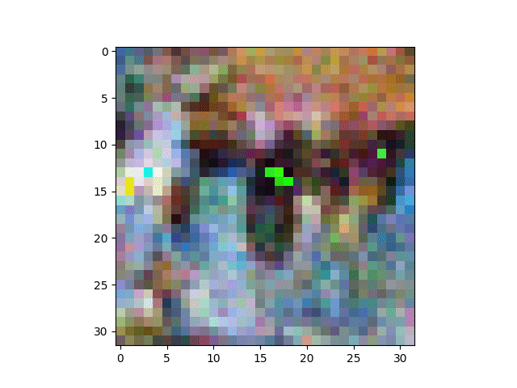

# Diffusion-Probabilistic-Models-Solver

This repository contains an implementation and in-depth mathematical analysis of the paper:

**[DPM-Solver: A Fast ODE Solver for Diffusion Probabilistic Model Sampling in Around 10 Steps](https://arxiv.org/abs/2206.00927)**  
by Jiaming Song, Chenlin Meng, and Stefano Ermon (NeurIPS 2022).

---

## About the Project

Diffusion Probabilistic Models (DPMs) are powerful generative models but often require hundreds or thousands of sampling steps to generate high-quality data. The DPM-Solver significantly reduces this to around 10 steps, using a tailored high-order ODE solver.

This repository:
- Re-implements the DPM-Solver-1, DPM-Solver-2, and DPM-Solver-3 methods.
- Includes step-by-step mathematical derivations of the algorithm.
- Reproduces experiments with toy datasets and CIFAR-10, comparing performance with DDPM and DDIM solvers.

---

## Theoretical Insights

The core idea is to transform the stochastic differential equations of DPMs into a probability flow ODE, taking advantage of its semi-linear structure.

The reverse process relies on a neural network, `ϵθ(x, t)`, to estimate the noise (score function). Using variation of constants, the paper derives an efficient ODE solver with an analytical form of the solution, enabling exponential integration.

We derived and proved:
- The closed-form ODE solution via exponential integrators.
- High-order solver schemes up to 3rd order with error analysis.
- The mathematical foundations and assumptions behind the solver design.

**Contents of the Supplementary Document:**
- A step-by-step derivation of the forward diffusion SDE and its equivalent form.
- Reverse-time SDE derivation using Anderson's result and substitution of the score function.
- Derivation of the loss function used to train the noise-prediction model `ϵθ(x, t)`.
- Transformation of the reverse SDE into a probability flow ODE and its semi-linear formulation.
- Variation of parameters method applied to derive the general ODE solution in integral form.
- Definition and role of the transformation function `λ(t) = log(α(t)/σ(t))`.
- Derivation of the solver update rule (Proposition 1) as an exponentially weighted integral.
- Complete derivation of high-order solvers using.

For full derivations and proofs, refer to the supplementary document:  
`Suplementary text with demonstrations - DPMSolver.pdf`
